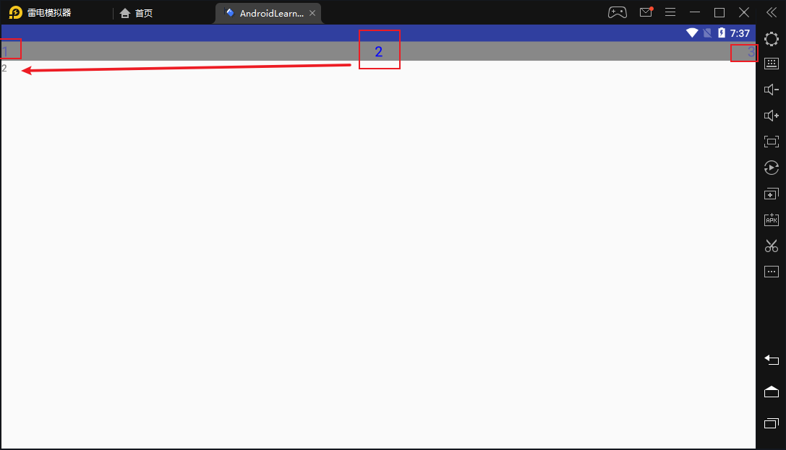
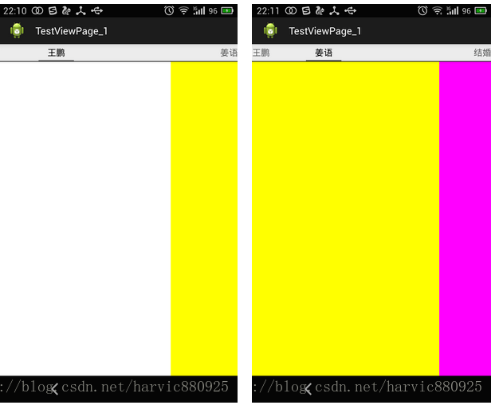
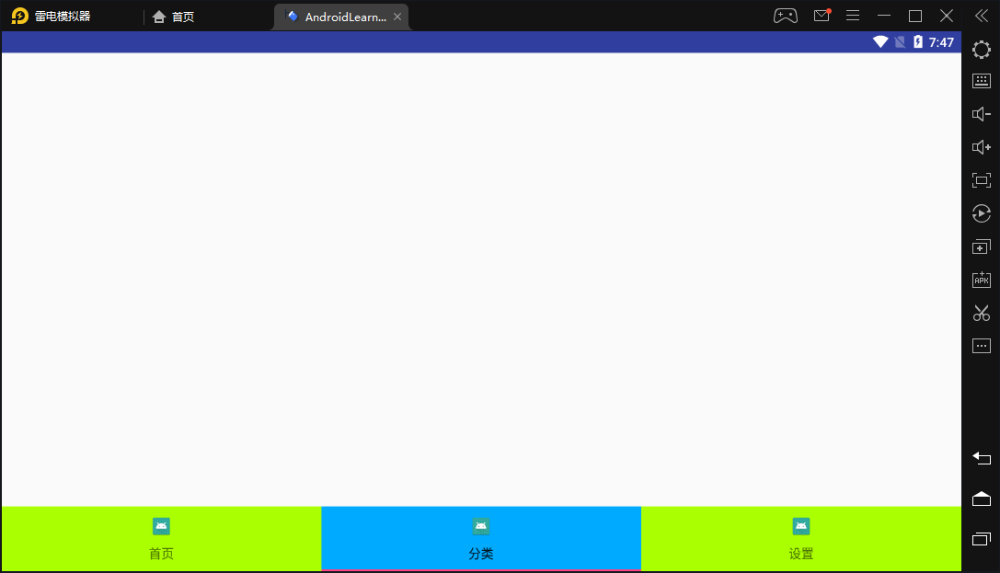
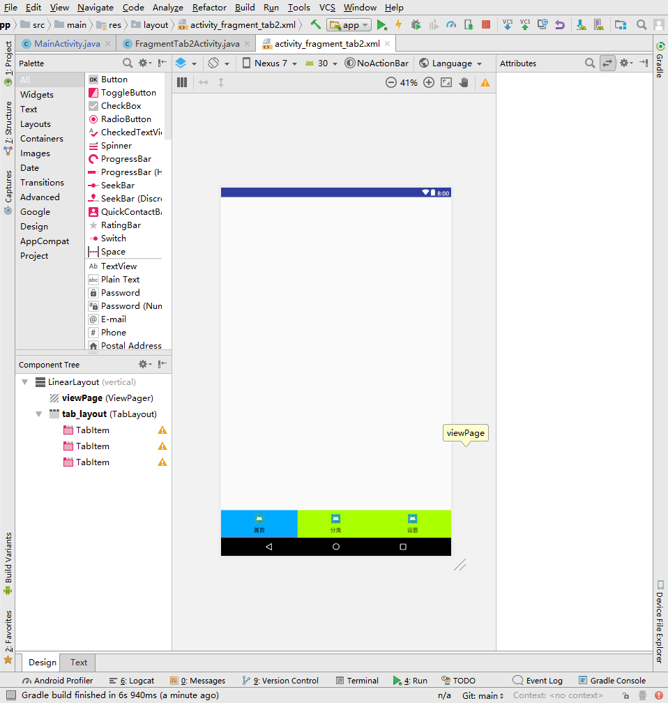
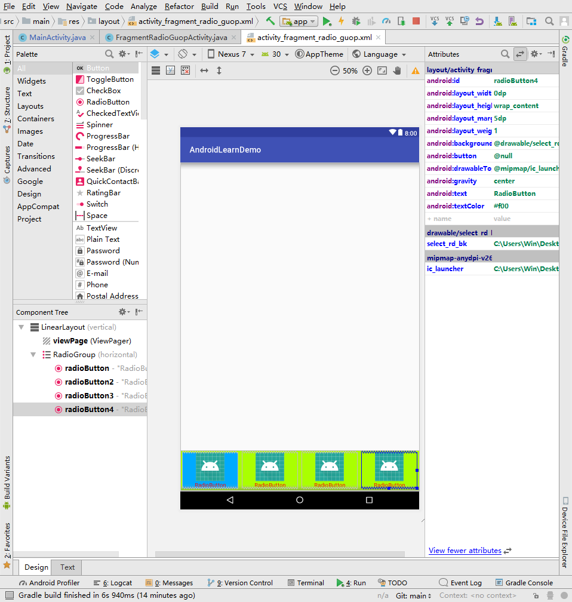
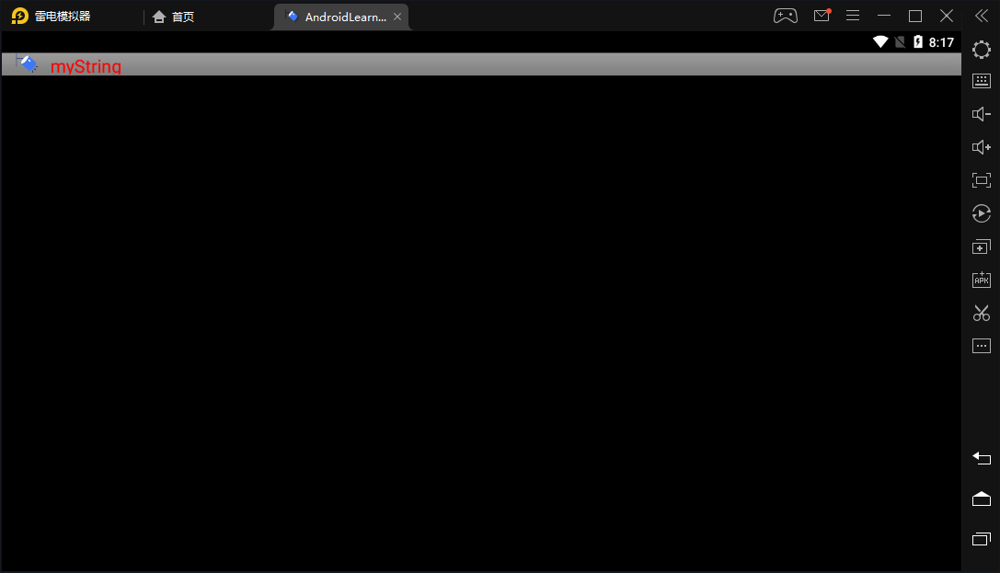
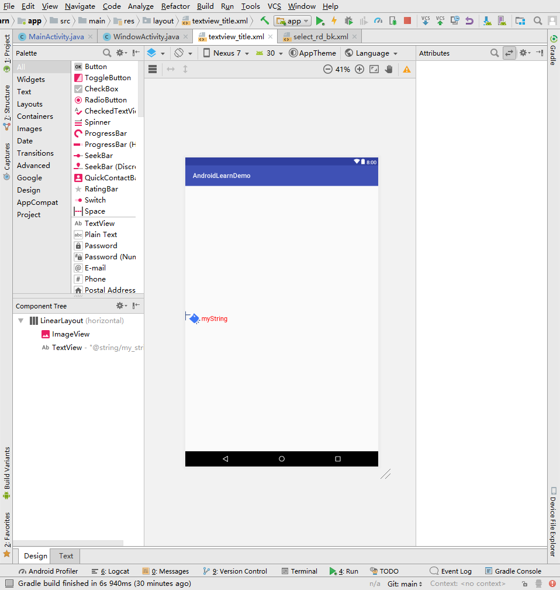

# 安卓代码学习Demo

## 写在前面

#### 公开目的

方便大家交流与学习Android方面知识，有兴趣的可以加交流群：**611264118**

#### 作者

yufeng（余风），QQ：1286372074

------


## 目录

[TOC]

## 项目结构

#### [Layout]RelativeLayout学习

> **总结**

再说吧，用来都懂，懂的都懂，不懂的也不用说。


#### [Socket]企想android_v5包socket连接测试、跨界面获取连接状态

> **<u>对应界面：SocketClientActivity、SocketGetClientActivity</u>**

> **总结**

1. Socket通讯使用单例模式，可以通过跨界面显示
2. Socket连接回调函数同时只能存在一个，所以多出实例化，前者会被后者替换
3. 状态分为3种，连接成功、连接失败在常量表中有，第三种为重连中，可以用来设置重连


#### [View]ViewPage+PagerTitleStripe实现Fragment标题随滑动显示



> **<u>对应界面：FragmentTitleStripeActivity</u>**

> **基本描述**

​	是当前、下一页和前一页的非交互指标。将其放在ViewPage中作为ViewPage的子控件

> **常用方法**

```java
pagerTitleStripe.setBackgroundColor(Color.GRAY);//设置背景颜色
pagerTitleStripe.setTextColor(Color.BLUE);//设置字体颜色
pagerTitleStripe.setNonPrimaryAlpha(0.3f);//设置未选中的透明度
pagerTitleStripe.setTextSize(1, 20);//设置字体大小
```

> **关于其他**

有人可能要问了，有没有交互式的控件呢，有的就是PageTabStripe，以下为官方描述：

> 寻呼机是当前、下一页和前几页的交互式指标。它旨在用作 XML 布局中视图Pager小部件的儿童视图。将其添加为布局文件中的 ViewPager 的孩子，并将其 Android：layout_gravity设置为顶部或底部，将其固定到视图页面的顶部或底部。每个页面的标题由提供给 ViewPager 的适配器中的方法提供。`ViewPager``PagerAdapter#getPageTitle(int)`
>
> 


#### [View]ViewPage+TabLayout+TabItem实现Fragment标题交互式滑动显示**



> **<u>对于界面：FragmentTab2Activity</u>**

> **基本描述**

Tab 布局提供水平布局以显示选项卡。

1. 要显示的选项卡的群数是通过实例完成的。您通过.从那里，您可以通过和分别更改选项卡的标签或图标。要显示选项卡，您需要通过其中一种方法将其添加到布局中。例如：`TabLayout.Tab``newTab()``TabLayout.Tab.setText(int)``TabLayout.Tab.setIcon(int)``addTab(Tab)`

2. 当任何选项卡的选择状态已更改时，您应该通过添加侦听器来通知他们。`addOnTabSelectedListener(OnTabSelectedListener)`

3. 如果您使用的是与此布局一起使用的，您可以调用将两者链接在一起。此布局将从"页面标题"中自动填充。`ViewPager``setupWithViewPager(ViewPager)``PagerAdapter`

此视图还支持用作 ViewPager 装饰的一部分，并且可直接在布局资源文件中添加到视图Pager 中， 如下所见：

> **布局代码**



```xml
<?xml version="1.0" encoding="utf-8"?>
<LinearLayout xmlns:android="http://schemas.android.com/apk/res/android"
    xmlns:app="http://schemas.android.com/apk/res-auto"
    xmlns:tools="http://schemas.android.com/tools"
    android:layout_width="match_parent"
    android:layout_height="match_parent"
    android:orientation="vertical"
    tools:context="com.example.administrator.androidlearndemo.activity.view.FragmentTab2Activity">

    <android.support.v4.view.ViewPager
        android:id="@+id/viewPage"
        android:layout_width="match_parent"
        android:layout_height="0dp"
        android:layout_weight="1">


    </android.support.v4.view.ViewPager>


    <android.support.design.widget.TabLayout
        android:id="@+id/tab_layout"
        android:layout_width="match_parent"
        android:layout_height="wrap_content"
        android:layout_gravity="bottom"
        app:tabBackground="@drawable/select_tab_item"
        app:tabGravity="fill"
        app:tabMaxWidth="0dp"
        app:tabMode="fixed"
        app:tabPadding="5dp">

        <android.support.design.widget.TabItem
            android:layout_width="0dp"
            android:layout_height="wrap_content"
            android:icon="@mipmap/ic_launcher"
            android:text="首页" />

        <android.support.design.widget.TabItem
            android:layout_width="wrap_content"
            android:layout_height="wrap_content"
            android:icon="@mipmap/ic_launcher"
            android:text="分类" />

        <android.support.design.widget.TabItem
            android:layout_width="wrap_content"
            android:layout_height="wrap_content"
            android:icon="@mipmap/ic_launcher"
            android:text="设置" />

    </android.support.design.widget.TabLayout>


</LinearLayout>

```

> **其他补充**

tabItem可以**静态**声明也可以**动态**声明，这里我没有详细使用，到时候遇到详细情况我来更新。


#### [View]RadioGruop+RadioButton实现带图标单选按钮选择显示Fragment



> **<u>对于界面：FragmentRadioGuopActivity、FragmentRadioGuop2Activity</u>**

> **总结**

1. android:background设置select选择过滤器文件的时候，设置背景颜色不能使用<item>标签的android:color，必须使用<shape>标签
2. 设置选中颜色为<item>标签中的android:color属性
3. 在RadioButton等继承TextView的控件中添加图标的属性为：`android:drawableTop` `android:drawableLeft` 等方式设置图标


#### [View]使用Window设置自定义标题



> **<u>对应界面：WindowActivity</u>**

```java

    @Override
    protected void onCreate(Bundle savedInstanceState) {
        super.onCreate(savedInstanceState);
        //设置标题类型为自定义
        requestWindowFeature(Window.FEATURE_CUSTOM_TITLE);
        setContentView(R.layout.activity_window);
        //设置标题自定义样式
        getWindow().setFeatureInt(Window.FEATURE_CUSTOM_TITLE, R.layout.textview_title);

    }
```




